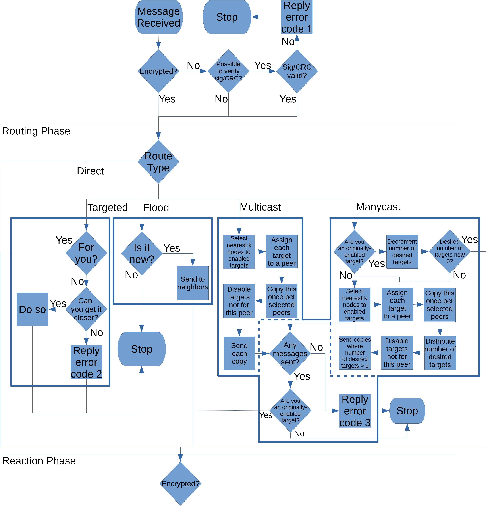

Message Structure
#################

.. contents::
    :depth: 2
    :local:

Versions 7+
===========

Components
++++++++++

Raw Area
~~~~~~~~

- protocol version encoded in 4 bytes
    - 2 for major
    - 1 for minor
    - 1 for patch
- UP data length

UP Area (Unsigned Plaintext)
~~~~~~~~~~~~~~~~~~~~~~~~~~~~

- routing info where en-route modification is necessary
- SP data length
- signature length (is this appropriate?)
- OEM data UP

SP Area (Signed Plaintext)
~~~~~~~~~~~~~~~~~~~~~~~~~~

- route type
- time as Unix time in ms
- timestamp nonce
- route info where en-route modification is disallowed
- target(s)
- SE compression type
- SE encryption type
- OEM data SP

SE Area (Signed and Encrypted)
~~~~~~~~~~~~~~~~~~~~~~~~~~~~~~

- sender
- channel from
- message type
- payload
- signature type
- OEM data SE

Version Handling
++++++++++++++++

Versions are split into three fields using semantic versioning. There is exactly one exception to this, which is if the
version field has the most significant bit set, which indicates this is a test build that should not be interpreted by
stable clients outside of a test environment.

The version block is always serialized into four big-endian bytes as follows:

.. code::

    +----------------+--------+--------+--------+
    | test (1b) | major (15b) |  minor |  patch |
    +----------------+--------+--------+--------+

When communicating version support to other nodes, a shorthand may be used by filling a field with 1s to denote that
you support all values. So the equivalent of 1.*.* would be ``0x0001FFFF``. As a consequence of this, the acceptable
version range for minor and patch are limited to 0-254.

Message Handling
++++++++++++++++

Messages in Retrion are handled as an RPC-like system. Receiving a message can roughly be translated as:

.. code:: python

    for message in receive_queue:
        if not message.encrypted and message.can_check_integrity(self.keystore):
            if not message.check_integrity(self.keystore):
                message.reply(self, error=1)
                continue
        # routing phase
        try:
            self.route(message)
        except Exception as e:
            message.reply(self, error=e.args[0])
            continue

        # reaction phase
        if message.intended_for(self):
            try:
                decrypt(message)
                if message.unencrypted():
                    message.check_integrity()
            except Exception as e:
                message.reply(self, error=e.args[0])
                continue
            self.react_to(message)

Routing Strategies
++++++++++++++++++

Routing strategies are defined by the behavior expected of a node receiving the message, and by the information it
places into ``up.routing_info``, ``sp.routing_info``, ``sp.route_type`` and ``sp.targets``.

Direct
~~~~~~

Direct routing is defined as any message with ``sp.route_type`` set to ``0``. Other fields are set to ``None``,
including ``targets``.

Targeted
~~~~~~~~

The goal of targeted routing is to allow nodes to communicate even if they are blocked from sending packets directly
to each other, whether this is because of a NAT, a lack of common transport protocols, or other reasons.
Implementations are encouraged to include such nodes in their routing table if they are unable to directly communicate
with many nodes in a given range.

Targeted routing is defined as any message with ``sp.route_type`` set to ``1``. While en route, the ``se.channel``
field should be ignored in favor of ``up.routing_info``, which contains two integers. The first can in this case be
thought of as the "relay channel" field. This allows you to route messages through the network without needing a
common-channel path. ``sp.route_info`` should be set to ``None``. The second field contains an integer which tracks the
overlay network hop count and should be incremented with each forward. ``sp.target`` should be set to the ID of the
intended end node.

Nodes who receive a targeted message are expected to pass it on to a nearer node if it is not for them. They must do
this from among the ``k`` closest nodes they know of to the target, but nodes may pick preferentially among these by
heuristics like latency and bandwidth, rather than strictly targeting the nearest node.

If it is not possible to forward such a message, a node should reply to this message with a NACK with a status of 2.
Intermediate nodes are expected to watch for this reply and forward it towards the original sender.

Multicast
~~~~~~~~~

The goal of multicast routing is to allow group messaging protocols to use less resources on the network. It
accomplishes this by enabling multicast behavior in the routing, such that fewer total messages need to go across the
wire. Implementations can vary in how well they support this. In the ideal case most message sends are intended for
multiple end targets and a large fraction of overall bandwidth is saved. In the worst case where an implementation
supports it poorly and always routes to each node individually, then such messages will be slightly larger than they
would if each entry were sent as an targeted message to each member, but this would be at the advantage of having more
metadata baked into the message.

Multicast routing is defined as any message with ``sp.route_type`` set to ``2``. The ``up.routing_info`` field will
contain an array with three items. The first two are equivalent to the fields discussed above. The last entry is a big-
endian bytestring where each bit indicates that the corresponding entry in ``sp.targets`` is a target of this copy of
the message. If a target is disabled this means that a receiver of this message should not forward it towards that
node, as it is already being done by other nodes.

For end nodes, the ``se.channel`` field should also be ignored in favor of ``sp.routing_info``, which will contain an
array of channel identifiers in the same order as the ``sp.targets`` field. This allows you to route messages through
the network without needing a common-channel path.

Implementations are encouraged (but not required) to fill in ``se.channel`` after deserialization and integrity
checking such that checking ``sp.route_type`` is unnecessary in this instance. If an implementation does so, it is
required to patch the integrity checking code such that this does not affect the outcome of checking a message.

Nodes who receive a multicast message are expected to pass it on to a nearer node if it is not exclusively for them.
They must do this from among the ``k`` closest nodes they know of to the target, but nodes may pick preferentially
among these by heuristics like latency and bandwidth, rather than strictly targeting the nearest node.

Implementations are highly encouraged to group multicast messages together with the same intermediate nodes wherever
feasible. This reduces bandwidth use by a large amount.

If at any point it is not possible to get a message closer to a target, reply with a NACK with status code 3.
Intermediate nodes are expected to watch for this reply and forward it towards the original sender. The return payload
of this message should contain an array with copies of ``up.route_info`` and ``sp.route_info`` for the failed message.

Manycast
~~~~~~~~

The goal of multicast routing is to allow a degree of load balancing when accessing application-level services. It
accomplishes this by enabling random behavior in multicast routing, such that this is more consistent than client-side
selection. Implementations can vary in how well they support this. In the ideal case most message sends are intended
for multiple end targets and a large fraction of overall bandwidth is saved. In the worst case where an implementation
supports it poorly and always routes to each node individually, then such messages will be slightly larger than they
would if each entry were sent as an targeted message to each member, but this would be at the advantage of having more
metadata baked into the message.

Manycast routing is defined as any message with ``sp.route_type`` set to ``3``. Its routing data is almost identical to
that of Multicast routing with exceptions outlined below:

The ``up.route_info`` field will contain one additional item, an unsigned integer encoding what portion of the targets
field should be delivered to. This parameter will be called ``t`` for short.

The ``sp.route_info`` field may contain an array of two arrays instead. The first array is like that of multicast
routing. The second array is an array of node weights for use in selecting forwarding. If this is not present, weights
should be assumed to all be ``1``.

Routing will proceed like in multicast messages, with the following excpetions:

If a receiving node is an enabled target, it should decrement ``t``.

If ``t`` is ``0`` (or lower, though that would be a protocol violation) in any message, it should not be sent.

When sending a copy of a message to multiple nodes, the value of ``t`` should be distributed randomly among the copies
with the weights of each message's enabled targets acting as the weights of each copy.

Flood
~~~~~

Tree
~~~~

Serialization
+++++++++++++

Use of MessagePack
~~~~~~~~~~~~~~~~~~

MessagePack Syntax Additions
~~~~~~~~~~~~~~~~~~~~~~~~~~~~

.. code::

    +--------+--------+========+~~~~~~~~+
    | length |  field | field? |  field |
    +--------+--------+========+~~~~~~~~+
             |====group name===|
             |~~~1st~~|        |~~~tf~~~|
             |----1st--read--process----|
             |~~2nd~transform~~|
             |----2nd--read--process----|

The field with a question mark indicates an optional field. These should always come with some clarification on how
to interpret the data if a field is missing, including how to know which fields are the ones missing.

The items below are referred to as ribbons. Ribbons are used to label groups or transformations on the data set.
Ribbons are not required to be contiguous, though it is usually easier to read if they are.

A double-bar ribbon (like the first) indicates that some set of fields are related. Usually this is further explained
in the description unless the meaning is obvious, such as in:

.. code::

    +========+========+========+========+========+========+
    |   x1   |   y1   |   z1   |   x2   |   y2   |   z2   |
    +========+========+========+========+========+========+
    |=======P1=coordinates=====|=======P2=coordinates=====|

A wavy-bar ribbon (like the second and fourth) indicate that the labelled material is transformed in some way.
Contiguous ribbons indicate transformation on the bytes which make up those segments (ex: "encrypted"). Discontiguous
ribbons of this type indicate an individual transformation on each segment in the set, rather than as a group. Such
transformations always take place from top to bottom when serializing and, unless noted otherwise, reversed from
bottom to top when deserializing. Imagine it as dropping values through slots to get bytes, or as reaching in and
retrieving values from the base.

.. code::

    +--------+--------+========+~~~~~~~~+
    | length |  field |  field |  field |
    +--------+--------+========+~~~~~~~~+
             |~~incre~|        |~mented~|
             |~~~~~~~~~encrypted~~~~~~~~|

A single-bar ribbon (like the third and fifth) indicate that the labelled material is read from as part of a process
but not transformed in any way. A discontiguous wavy-bar ribbon can contain sections that are single-bar to indicate
that the wavy-bar areas are set based on data in the single-bar regions.

.. code::

    +--------+--------+========+~~~~~~~~+
    | length |  field |  field |  field |
    +--------+--------+========+~~~~~~~~+
    |~~~~~~~~|        |---byte-length---|

However, this practice is not recommended as it is difficult to differentiate the tilde from the hyphen in many
fonts. A way to modify such a diagram to only contain a single-bar ribbon would be, if the name of a field
corresponds to some obvious reading of the data (length, hash, etc.), to simply label the ribbon after the field it
informs.

.. code::

    +--------+--------+========+~~~~~~~~+
    | length |  field |  field |  field |
    +--------+--------+========+~~~~~~~~+
                      |---byte-length---|

Message Types and Properties
++++++++++++++++++++++++++++

.. toctree::
    :maxdepth: 2

    messages/ACK
    messages/PING
    messages/FIND_NODE
    messages/FIND_KEY
    messages/STORE
    messages/HELLO
    messages/IDENTIFY